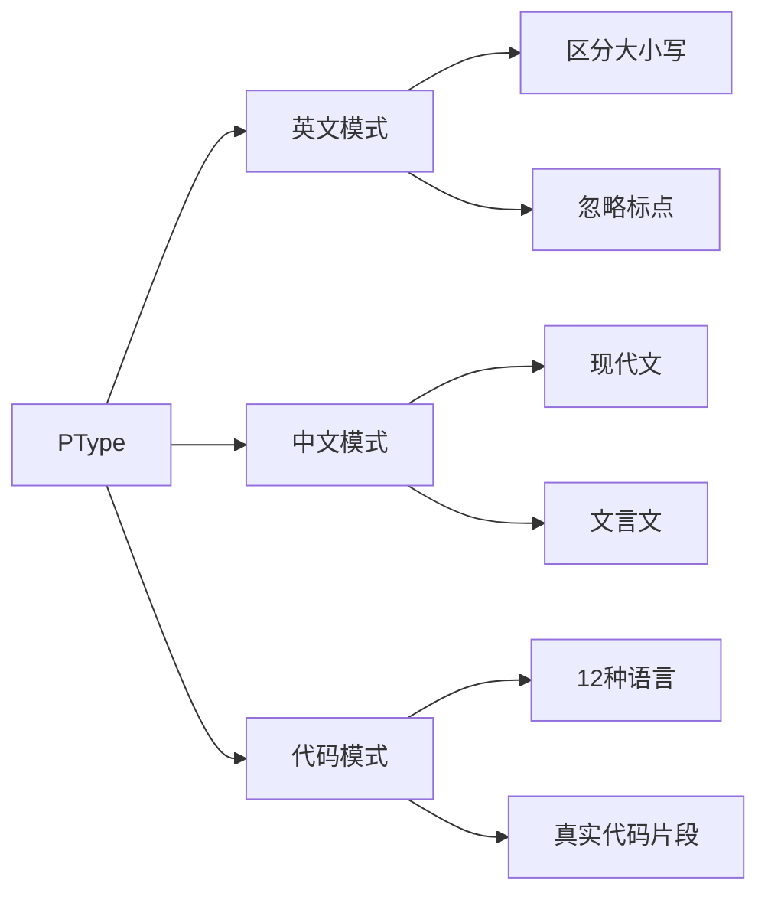

<div align="center">

# ⚡ PType

### 🚀 下一代打字练习平台

_通过AI驱动的多语言支持，掌握您的打字技能_

[](https://www.typescriptlang.org/)
[](https://reactjs.org/)
[](https://nextjs.org/)
[](https://tailwindcss.com/)
[](LICENSE)

**[🇨🇳 简体中文](README.md) | [🇺🇸 English](README_EN.md)**

[✨ 特性](#-特性) • [🎯 演示](#-演示) • [🚀 快速开始](#-快速开始) • [📖 文档](#-文档)

---


</div>

---

## 🌟 为什么选择 PType？

<table>
<tr>
<td width="33%" align="center">
  
### 🎨 精美界面
现代化玻璃态设计，流畅动画效果
  
</td>
<td width="33%" align="center">
  
### 🌍 多语言支持
英文、中文、12种以上编程语言代码
  
</td>
<td width="33%" align="center">
  
### 📊 实时分析
实时WPM、CPM、LPM追踪，详细图表展示
  
</td>
</tr>
</table>

---

## ✨ 特性

### 🎯 核心功能



<details>
<summary><b>🔥 高级功能</b></summary>

- ⚡ **实时速度指标**
  - WPM（每分钟字数）- 英文模式
  - CPM（每分钟字符数）- 中文模式
  - LPM（每分钟行数）- 代码模式

- 🎨 **视觉反馈**
  - ✅ 正确字符绿色高亮
  - ❌ 错误字符红色高亮
  - 📊 实时准确率百分比

- 🌐 **多语言支持**
  - **英文**：3个难度等级，30+练习文本
  - **中文**：现代文 & 文言文支持
  - **代码**：Python、JavaScript、Java、Go、C++等！

- 🎯 **智能难度系统**
  - 🟢 简单：基础词汇和语法
  - 🟡 中等：中级复杂度
  - 🔴 困难：高级模式和结构

- 💻 **代码模式专属功能**
  - Tab键支持缩进
  - 逐行命令练习（Bash/PowerShell）
  - 145+独特代码片段
  - 来自真实项目的语法

</details>

---

## 🎨 截图展示

<div align="center">

### 英文模式


### 中文模式


### 代码模式


### 结果面板


</div>

---

## 🛠️ 技术栈

<div align="center">

| 类别 | 技术 |
|----------|-------------|
| **前端框架** | React 18, Next.js 14, TypeScript |
| **样式** | TailwindCSS, Framer Motion |
| **状态管理** | Zustand |
| **图表** | Recharts |
| **图标** | Lucide React |
| **构建工具** | Turbopack |

</div>

---

## 🚀 快速开始

### 环境要求

```bash
node >= 18.0.0
npm >= 9.0.0
```

### 安装步骤

```bash
# 克隆仓库
git clone https://github.com/yourusername/ptype.git

# 进入项目目录
cd ptype/frontend

# 安装依赖
npm install

# 启动开发服务器
npm run dev
```

访问 `http://localhost:3000` 🎉

---

## 📖 文档

### 项目结构

```
ptype/
├── frontend/
│   ├── src/
│   │   ├── app/                 # Next.js 应用目录
│   │   ├── components/          # 可复用UI组件
│   │   ├── features/            # 功能模块
│   │   │   ├── settings/        # 设置面板
│   │   │   └── typing-test/    # 核心打字测试逻辑
│   │   ├── lib/                 # 工具类和常量
│   │   │   ├── constants.ts     # 应用常量
│   │   │   └── utils/           # 工具函数
│   │   └── styles/              # 全局样式
│   ├── public/                  # 静态资源
│   └── package.json
└── README.md
```

### 可用模式

#### 📝 英文模式
- **难度等级**：简单、中等、困难
- **选项**： 
  - 区分大小写
  - 忽略标点符号
- **指标**：WPM + CPM

#### 🇨🇳 中文模式
- **文体类型**：
  - 现代文
  - 文言文（论语、孟子、道德经等）
- **指标**：CPM

#### 💻 代码模式
- **支持语言**：
  ```
  Python  JavaScript  TypeScript  Java  C++  C  Go  Dart
  HTML    CSS         Bash        PowerShell
  ```
- **功能特性**：
  - Tab键支持
  - 真实代码片段
  - 逐行命令（Bash/PowerShell）
- **指标**：LPM + CPM

---

## 🎯 使用示例

### 英文练习
```typescript
// 选择英文模式
mode: 'english'
difficulty: 'medium'
options: {
  caseSensitive: true,
  ignorePunctuation: false
}
```

### 中文练习
```typescript
// 选择中文模式
mode: 'chinese'
style: 'modern'  // 或 'classical'
difficulty: 'hard'
```

### 代码练习
```typescript
// 选择代码模式
mode: 'coder'
language: 'python'
difficulty: 'medium'
```

---

## 📊 性能指标

### 速度计算

| 模式 | 主要指标 | 计算公式 |
|------|---------------|---------|
| **英文** | WPM | `(正确字符数 / 5) / 分钟数` |
| **中文** | CPM | `正确字符数 / 分钟数` |
| **代码** | LPM | `(总行数 × 完成率) / 分钟数` |

所有模式都追踪：
- ✅ 准确率百分比
- ⚡ 实时速度更新
- 📈 历史性能图表

---

## 🎨 核心功能详解

### 🌍 多语言文本库

#### 英文文本（30篇）
- **简单**：基础短句，日常用语
- **中等**：完整段落，常见表达
- **困难**：复杂句式，名言警句

#### 中文文本（36篇）
**现代文（18篇）**
- 简单：生活日常描述
- 中等：散文、故事片段
- 困难：哲学思考、深度文章

**文言文（18篇）**
- 简单：论语名句
- 中等：孟子、诗词
- 困难：大学、道德经

#### 代码库（145+片段）
**覆盖语言**：
- Python（22个）
- JavaScript（18个）
- Java（12个）
- Go（10个）
- Bash命令（35个）
- PowerShell命令（32个）
- 其他（16个）

### 🎯 智能特性

- **自动难度识别**：根据文本复杂度自动分类
- **随机文本生成**：每次练习内容不重复
- **智能字符匹配**：Unicode标准化处理
- **实时错误提示**：即时视觉反馈

---

## 🤝 贡献指南

我们欢迎各种形式的贡献！以下是参与方式：

1. 🍴 Fork 本仓库
2. 🌿 创建特性分支 (`git checkout -b feature/AmazingFeature`)
3. 💾 提交更改 (`git commit -m '添加某个很棒的功能'`)
4. 📤 推送到分支 (`git push origin feature/AmazingFeature`)
5. 🎉 开启 Pull Request

### 开发规范

- ✅ 遵循 TypeScript 最佳实践
- 📝 编写有意义的提交信息
- 🧪 充分测试您的更改
- 📚 必要时更新文档

---

## 🗺️ 开发路线图

- [ ] 🌐 多人竞技模式
- [ ] 🏆 排行榜系统
- [ ] 📱 移动端响应式设计
- [ ] 🎮 游戏化元素
- [ ] 🔊 音效反馈
- [ ] 🌙 深色/浅色主题切换
- [ ] 📊 高级分析仪表板
- [ ] � 社交分享功能
- [ ] 🎯 自定义文本导入
- [ ] 🤖 AI生成练习文本
- [ ] 🎵 背景音乐/白噪音
- [ ] 🏅 成就系统
- [ ] 📈 长期进步追踪
- [ ] 👥 用户账户系统

---

## 💡 技术亮点

### 性能优化
- ⚡ 使用 Zustand 进行高效状态管理
- 🚀 Next.js 14 App Router 实现快速路由
- 💨 TailwindCSS JIT 编译优化CSS
- 🎯 代码分割和懒加载

### 用户体验
- 🎨 Framer Motion 实现流畅动画
- ⌨️ 完整的键盘事件处理
- 🎯 实时视觉反馈
- 📊 交互式数据可视化

### 代码质量
- � 完整的 TypeScript 类型定义
- 🧩 模块化组件设计
- 🔧 可扩展的架构
- 📝 详细的代码注释

---

## 📝 许可证

本项目基于 MIT 许可证 - 查看 [LICENSE](LICENSE) 文件了解详情。

---

## 🙏 致谢

- 🎨 设计灵感来自 [MonkeyType](https://monkeytype.com)
- 📚 文本内容来自公共领域资源
- 💻 使用优秀的开源技术构建

---

## 📧 联系方式

<div align="center">

**有问题或建议？**

[](https://github.com/yourusername/ptype/issues)
[](mailto:your.email@example.com)

</div>

---

<div align="center">

### ⭐ 如果觉得有帮助，请给个星标！

**用 ❤️ 制作**

[](https://github.com/yourusername/ptype/stargazers)
[](https://github.com/yourusername/ptype/network/members)

[⬆ 回到顶部](#-ptype)

</div>
