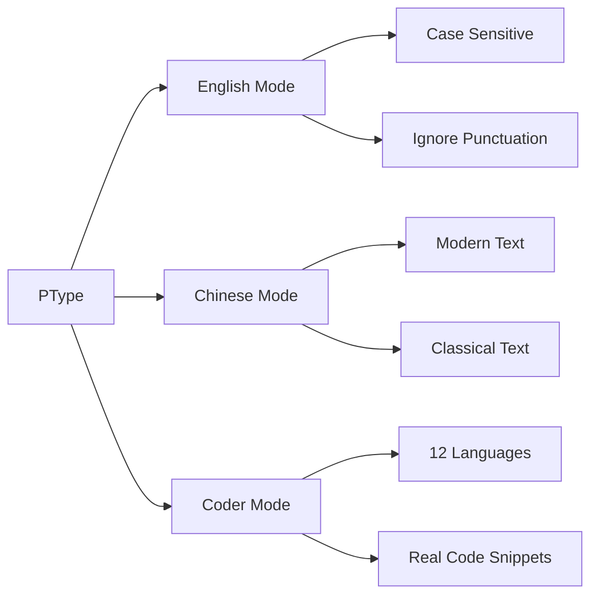

<div align="center">

# ⚡ PType

### 🚀 Next-Generation Typing Practice Platform

_Master your typing skills with AI-powered, multi-language support_

[](https://www.typescriptlang.org/)
[](https://reactjs.org/)
[](https://nextjs.org/)
[](https://tailwindcss.com/)
[](LICENSE)

**[🇨🇳 简体中文](README.md) | [🇺🇸 English](README_EN.md)**

[✨ Features](#-features) • [🎯 Demo](#-demo) • [🚀 Quick Start](#-quick-start) • [📖 Documentation](#-documentation)

---


</div>

---

## 🌟 Why PType?

<table>
<tr>
<td width="33%" align="center">
  
### 🎨 Beautiful UI
Modern glassmorphism design with smooth animations
  
</td>
<td width="33%" align="center">
  
### 🌍 Multi-Language
English, Chinese, Code in 12+ programming languages
  
</td>
<td width="33%" align="center">
  
### 📊 Real-time Analytics
Live WPM, CPM, LPM tracking with detailed charts
  
</td>
</tr>
</table>

---

## ✨ Features

### 🎯 Core Features



<details>
<summary><b>🔥 Advanced Features</b></summary>

- ⚡ **Real-time Speed Metrics**
  - WPM (Words Per Minute) for English
  - CPM (Characters Per Minute) for Chinese
  - LPM (Lines Per Minute) for Code

- 🎨 **Visual Feedback**
  - ✅ Green highlighting for correct characters
  - ❌ Red highlighting for errors
  - 📊 Live accuracy percentage

- 🌐 **Multi-Language Support**
  - **English**: 30+ practice texts across 3 difficulty levels
  - **Chinese**: Modern & Classical Chinese support
  - **Code**: Python, JavaScript, Java, Go, C++, and more!

- 🎯 **Smart Difficulty System**
  - 🟢 Easy: Basic vocabulary and syntax
  - 🟡 Medium: Intermediate complexity
  - 🔴 Hard: Advanced patterns and structures

- 💻 **Code Mode Specifics**
  - Tab key support for indentation
  - Line-by-line command practice (Bash/PowerShell)
  - 145+ unique code snippets
  - Syntax from real-world projects

</details>

---

## 🎨 Screenshots

<div align="center">

### English Mode


### Chinese Mode


### Code Mode


### Results Dashboard


</div>

---

## 🛠️ Tech Stack

<div align="center">

| Category | Technologies |
|----------|-------------|
| **Frontend** | React 18, Next.js 14, TypeScript |
| **Styling** | TailwindCSS, Framer Motion |
| **State Management** | Zustand |
| **Charts** | Recharts |
| **Icons** | Lucide React |
| **Build Tool** | Turbopack |

</div>

---

## 🚀 Quick Start

### Prerequisites

```bash
node >= 18.0.0
npm >= 9.0.0
```

### Installation

```bash
# Clone the repository
git clone https://github.com/yourusername/ptype.git

# Navigate to the project
cd ptype/frontend

# Install dependencies
npm install

# Start development server
npm run dev
```

Visit `http://localhost:3000` 🎉

---

## 📖 Documentation

### Project Structure

```
ptype/
├── frontend/
│   ├── src/
│   │   ├── app/                 # Next.js app directory
│   │   ├── components/          # Reusable UI components
│   │   ├── features/            # Feature modules
│   │   │   ├── settings/        # Settings panel
│   │   │   └── typing-test/    # Core typing test logic
│   │   ├── lib/                 # Utilities and constants
│   │   │   ├── constants.ts     # App constants
│   │   │   └── utils/           # Utility functions
│   │   └── styles/              # Global styles
│   ├── public/                  # Static assets
│   └── package.json
└── README.md
```

### Available Modes

#### 📝 English Mode
- **Difficulty Levels**: Easy, Medium, Hard
- **Options**: 
  - Case Sensitive
  - Ignore Punctuation
- **Metrics**: WPM + CPM

#### 🇨🇳 Chinese Mode
- **Text Types**:
  - Modern Chinese (现代文)
  - Classical Chinese (文言文): Confucian Analects, Mencius, Tao Te Ching, etc.
- **Metrics**: CPM

#### 💻 Coder Mode
- **Supported Languages**:
  ```
  Python  JavaScript  TypeScript  Java  C++  C  Go  Dart
  HTML    CSS         Bash        PowerShell
  ```
- **Features**:
  - Tab key support
  - Real code snippets
  - Line-by-line commands (Bash/PowerShell)
- **Metrics**: LPM + CPM

---

## 🎯 Usage Examples

### English Practice
```typescript
// Select English mode
mode: 'english'
difficulty: 'medium'
options: {
  caseSensitive: true,
  ignorePunctuation: false
}
```

### Chinese Practice
```typescript
// Select Chinese mode
mode: 'chinese'
style: 'modern'  // or 'classical'
difficulty: 'hard'
```

### Code Practice
```typescript
// Select Coder mode
mode: 'coder'
language: 'python'
difficulty: 'medium'
```

---

## 📊 Performance Metrics

### Speed Calculations

| Mode | Primary Metric | Formula |
|------|---------------|---------|
| **English** | WPM | `(correct_chars / 5) / minutes` |
| **Chinese** | CPM | `correct_chars / minutes` |
| **Coder** | LPM | `(total_lines × completion_rate) / minutes` |

All modes track:
- ✅ Accuracy percentage
- ⚡ Real-time speed updates
- 📈 Historical performance charts

---

## 🎨 Content Library

### 🌍 Multilingual Text Database

#### English Texts (30 pieces)
- **Easy**: Basic phrases, daily vocabulary
- **Medium**: Complete paragraphs, common expressions
- **Hard**: Complex sentences, famous quotes

#### Chinese Texts (36 pieces)
**Modern Chinese (18 pieces)**
- Easy: Daily life descriptions
- Medium: Essays, story fragments
- Hard: Philosophical thinking, in-depth articles

**Classical Chinese (18 pieces)**
- Easy: Confucian Analects quotes
- Medium: Mencius, poetry
- Hard: The Great Learning, Tao Te Ching

#### Code Library (145+ snippets)
**Language Coverage**:
- Python (22 snippets)
- JavaScript (18 snippets)
- Java (12 snippets)
- Go (10 snippets)
- Bash commands (35 snippets)
- PowerShell commands (32 snippets)
- Others (16 snippets)

### 🎯 Smart Features

- **Auto Difficulty Recognition**: Automatically categorize by text complexity
- **Random Text Generation**: Non-repetitive practice content each time
- **Smart Character Matching**: Unicode normalization processing
- **Real-time Error Prompts**: Instant visual feedback

---

## 🤝 Contributing

We welcome contributions! Here's how you can help:

1. 🍴 Fork the repository
2. 🌿 Create a feature branch (`git checkout -b feature/AmazingFeature`)
3. 💾 Commit your changes (`git commit -m 'Add some AmazingFeature'`)
4. 📤 Push to the branch (`git push origin feature/AmazingFeature`)
5. 🎉 Open a Pull Request

### Development Guidelines

- ✅ Follow TypeScript best practices
- 📝 Write meaningful commit messages
- 🧪 Test your changes thoroughly
- 📚 Update documentation if needed

---

## 🗺️ Roadmap

- [ ] 🌐 Multi-player competition mode
- [ ] 🏆 Leaderboard system
- [ ] 📱 Mobile responsive design
- [ ] 🎮 Gamification elements
- [ ] 🔊 Sound effects
- [ ] 🌙 Dark/Light theme toggle
- [ ] 📊 Advanced analytics dashboard
- [ ] 🔗 Social sharing features
- [ ] 🎯 Custom text import
- [ ] 🤖 AI-generated practice texts
- [ ] 🎵 Background music/white noise
- [ ] 🏅 Achievement system
- [ ] 📈 Long-term progress tracking
- [ ] 👥 User account system

---

## 💡 Technical Highlights

### Performance Optimization
- ⚡ Zustand for efficient state management
- 🚀 Next.js 14 App Router for fast routing
- 💨 TailwindCSS JIT compilation for optimized CSS
- 🎯 Code splitting and lazy loading

### User Experience
- 🎨 Framer Motion for smooth animations
- ⌨️ Complete keyboard event handling
- 🎯 Real-time visual feedback
- 📊 Interactive data visualization

### Code Quality
- 📘 Full TypeScript type definitions
- 🧩 Modular component design
- 🔧 Extensible architecture
- 📝 Detailed code comments

---

## 📝 License

This project is licensed under the MIT License - see the [LICENSE](LICENSE) file for details.

---

## 🙏 Acknowledgments

- 🎨 Design inspiration from [MonkeyType](https://monkeytype.com)
- 📚 Text content from public domain sources
- 💻 Built with amazing open-source technologies

---

## 📧 Contact

<div align="center">

**Have questions or suggestions?**

[](https://github.com/yourusername/ptype/issues)
[](mailto:your.email@example.com)

</div>

---

<div align="center">

### ⭐ Star this repo if you find it helpful!

**Made with ❤️**

[](https://github.com/yourusername/ptype/stargazers)
[](https://github.com/yourusername/ptype/network/members)

[⬆ Back to Top](#-ptype)

</div>
